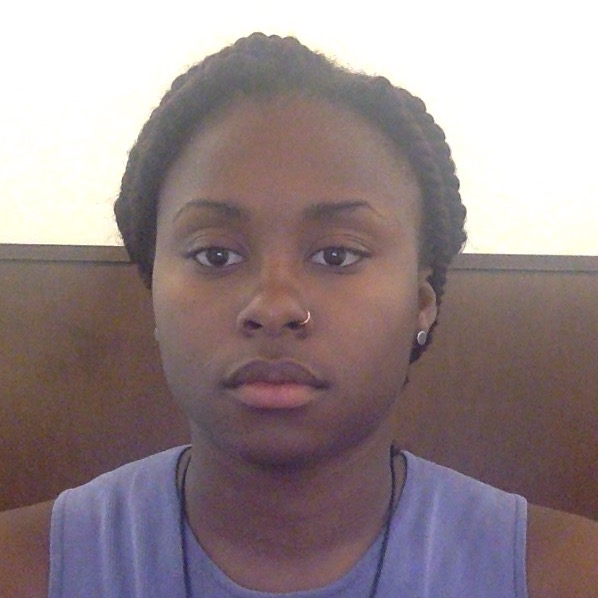
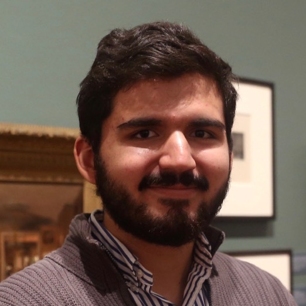
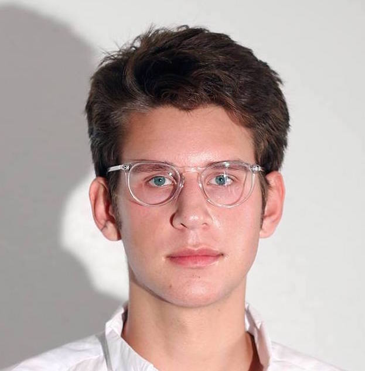

# Introduction

> "I've learned how to build websites, how they work, and how to think about data. I think this program is extremely necessary on campus and can be a great way to springboard technological interest and access for students who wouldn't otherwise receive it." - Amani

   

> "This Fellowship was an incredibly opportunity that, if anything, has made me even more excited to learn about new tools and software as well as embark on new digital projects!" - Andres

# [title tk - framing stuff]

My background is in English literature, in particular the study of the realist novel. In my more computational work, I've explored what it means to treat literary data as representation rather than fact--in much the same way that we might treat the realist novel as a representation of the social world, rather than the thing itself.

While only a fraction of my teaching for the DS Fellows program has focused on literature specifically, I've tried to cultivate in our students a similar sense that data, models, and visualizations are deeply social, created and maintained by humans making series of interpretive choices shaped by aesthetics, politics, and culture.

The Fellows have gotten a firsthand look at how these processes can unfold as they've created their own data, representations, and digital tools over the course of the year; I've also worked to make space for us to reflect on what principles we want to embed in our projects, and what kind of work we want them to do in the world. My hope is that the Fellows have come away from the program with a renewed critical consciousness about digital tools, but also a sense that their own work can contribute to the development of exciting new modes of representation and thought.

--Yumi Dineen Shiroma, Post-Baccalaureate Fellow for Digital Scholarship

# The Fellows

Our cohort of eight students came from a wide range of disciplines--urban studies, English, anthropology, computer science, and more--and included sophomores, juniors, and seniors. Some had extensive experience working on digital projects; others were drawn to the program as a first introduction to digital scholarship.

*The Fellows and program coordinators: Amani Bey '19, Abigail McGuckin '19, Yumi Dineen Shiroma (post-bac), Nick Joyner '19, Andres De los Rios '17, Kirara Sato (post-bac), Laurie Allen (Assistant Director for Digital Scholarship). Not pictured: Karis Stephen '18, Ying Luo '19, David Kinnaird '18, and Maia Effah Kaufmann '19.*

[Read more about our cohort here here.](http://upenndigitalscholarship.org/dsfellows16/cohort2016/)

# [Session 1: Introduction to Digital Scholarship](https://github.com/dsfellows/dsfellows/blob/master/week_1_agenda.md)

The Fellows met for the first time to discuss what digital scholarship is and what role it might play in their work across disciplines.

What does a term like "digital scholarship" mean when tools such as word processors, digital editions of texts, and search algorithms have become so ubiquitous in academic work? How can we, and should we distinguish between digital tools or methods and digital objects of study when defining digital scholarship?

# [Session 2: Beautiful Websites in the Clouds](https://github.com/dsfellows/dsfellows/blob/master/week_2_agenda.md)

In this session, the Fellows explored how the online world they interact with every day is created. How does a web browser find and display a website? What is a server? A DNS? When we store things in "the cloud," how are they preserved, and where are they kept physically?

Each of the Fellows chose a role and acted out a play Laurie wrote, which demonstrates what happens when you tell your browser to display a particular web page.

From there, we moved on to an exploration of how web pages are created in more practical terms. How do HTML, CSS, and Javascript combine to form beautiful web pages? What distinguishes static from dynamic websites? How does something like *this*...

... become something like *this*?

# [Session 3: Anatomy of Information](https://github.com/dsfellows/dsfellows/blob/master/week_3_agenda.md)

With the aid of John Pollack, the Library Specialist for Public Services at Penn's Kislak Center for Special Collections, Rare Books and Manuscripts, we took the fellows on a whirlwild tour of some of Penn's most exciting rare materials. After a brief tutorial on how to safely handle rare books, the Fellows paged through texts including a 16th-century Bible and concordance and an 18th-century edition of Samuel Johnson's dictionary, one of the first ever published in the English language.

They also explored *A Letter from William Penn proprietary governour of Pennsylvania in America to the committee of the Free Society of Traders of that province* (1683). This a printed manuscript includes a fold-out map of Penn's initial plan for the city of Philadelphia, organized around five public squares--each of which will host a Monument Lab site in 2017.

During this session, the Fellows talked through some of the (dis)continuities between print and digital media. What goes into digitizing these types of rare materials? How do concordances, indexes, and the like compare to digital technologies of search and organization that we use today? How can the printed past help us to think about our digital present?

# Session 4: Monument Lab, History, Memory

[Paul Farber](http://www.paulfarber.com/), Monument Lab Artistic Director and Urban Studies professor, joined us to discuss the project's take on collective memory and history, and how digital projects can drive social change.

*Six separate proposals call for monuments to the 1981 MOVE bombing, in which the Philadelphia police firebombed the 6200 block of Osage Avenue, targeting members of a Black liberation group. The attack killed eleven people, including five children. The proposals speak to many Philadelphians' sense that the city has not done enough to remember MOVE.*

# [Session 5: Web Design, Continued](https://github.com/dsfellows/dsfellows/blob/master/week_5_agenda.md)

The Fellows explored some basics of Git, a version control system optimized for tracking changes to code in collaborative digital projects. From there, we dived into Jekyll, a static site generator that can build minimal, fast-loading websites from simple HTML and CSS files.

Andres De los Rios went on to use Jekyll to build a professional website, hosting the files on Github Pages as we'd practiced during the session.

[View Andres's website in full here.](https://afrivers.github.io/website/)

# [Session 6: Data Wrangling](https://github.com/dsfellows/dsfellows/blob/master/week_6_agenda.md)

This session introduced the Fellows to metadata, the "data about data" that powers so much of the digital (and library) worlds. Each Fellow took ten minutes to sketch out their own Monument Lab proposal using the official Monument Lab form. Topics ranged from the MOVE bombing to Philadelphia's musical tradition to the expansion of Philadelphia along the banks of the Schuylkill.

Then, collaborating via Google Sheets, they created a metadata schema for recording information about those proposals and some others from Monument Lab. Even the creation of such a small data set turned out to require a complex series of decisions: to what extent should seemingly straightforward categories like address and age be standardized, given the wide variety of ways in which participants responded to those questions? Should metadata refer primarily to the proposal form itself, or to the monument bring proposed?

Building on the existing Monument Lab data set, the Fellows added categories noting whether the monument proposal involved an interactive element; recording (or guessing at) its medium and scale; and describing any images included in the proposal--with the goal of making the data set both more accessible to visually impaired readers and more easily searchable. They also invented their own subject tags based on the topics that appeared most frequently in the set of proposals.

[See the full data set here.](https://docs.google.com/spreadsheets/d/1jF9mQ_3x6tBwN7NIXqiGCHloE9pND46-LntBAjA8m0I/edit?usp=sharing)

From there, we switched gears to consider how best to work with messy data sets--like the one we'd just created. The Fellows experimented with ways of analyzing and cleaning existing Monument Lab data using [OpenRefine](http://openrefine.org/), an open-source tool designed to make work with large, complex data sets easier.

> "The session on OpenRefine was particularly impactful. Before [the DS Fellows program], if I downloaded relevant data that was arranged messily, I would not have known how to sort through it. However, the session on OpenRefine taught me how to make sense of such data using this new tool." - Abby

# [Session 7: Mapping](https://github.com/dsfellows/dsfellows/blob/master/week_7_agenda.md)

During this session, the Fellows explored various ways of recording and visualizing geographical data. Using Mapbox, an open-source tool for creating beautiful, granular visualizations, the Fellows investigated three separate, overlapping data sets: one of Monument Lab proposals, one of historic preservation sites in Philadelphia, and one of historical markers.

Nick Joyner used what he learned in this session to create a final project for a course on critical cartography: a visualization that compares Monument Lab proposals dealing with topics such as human rights, inequality, and gentrification with existing Philadelphia monuments on those same subjects.

[See the interactive version of Nick's project here.](https://njoyn.carto.com/builder/a7b6bdb0-26d8-11e7-b6ad-0ee66e2c9693/embed)

> "The program has completely redefined what I thought I understood as digital scholarship. I did not realize the great digitizations of written data, much less the various tools to use that information in different ways. As an urban studies major, I have taken away invaluable information. I will absolutely use my knowledge in Mapbox from DS in my future classes and research." - Abby

# [Session 8: Project Work](https://github.com/dsfellows/dsfellows/blob/master/week_8_agenda.md)

The Fellows brainstormed possible directions a Monument Lab-related project, carried out during their summer internship, might take.

First, splitting up into pairs, they researched the different [lab sites](https://www.muralarts.org/artworks/monumentlab/) the project will use in the fall. These include the five squares William Penn planned the city around (Franklin, Logan, Washington, Rittenhouse, and City Hall), plus five neighborhood parks (Penn Treaty Park, Vernon Park, Norris Square, Malcolm X Park, and Marconi Plaza).

They researched some questions: what is the history of each of these places? What kinds of monuments and historical markers already exist around them? What might be missing from the official record?

Finally, each group presented a proposal for how that site might be represented or memorialized--through a "virtual walkthrough" of the space, a film, a monument, or some other medium.

*Brainstorming notes: Ying and Andres on Rittenhouse Square; Nick and Karis on Malcolm X Park; and Abby and Maia on Norris Park.*

# [Session 9: Intro to Computational Text Analysis](https://github.com/dsfellows/dsfellows/blob/master/week_9_agenda.md)

This session introduced the Fellows to some basics of computational text analysis and text mining using a corpus of 27 publicly available texts about the city of Philadelphia, published between 1681 and 1921. We asked a number of questions about what it means to use these methods: Can we learn things from these computational methods that we couldn't learn from reading these texts straight through? And what can we learn about how Philadelphia has been imagined in writing from using these tools on this specific corpus?

First, the Fellows tested out [Voyant](https://voyant-tools.org/), which produces simple visualizations such as word clouds and word frequency counts:

Next, the Fellows experimented with topic modeling, which uses Bayesian statistical models to identify clusters of words that are likely to appear together within certain texts. Over recent years, topic models have become an increasingly popular tool for digital humanities work.

*One model of the "topics" that made up the Philadelphia corpus.*

> "I really enjoyed the session on topic modeling and data visualizations, especially since they are both tools that, in my opinion, could help bridge the current gap between specialized scholarship and general audiences (be it in books, journals, museums, or the like)." - Andres

# [Session 10: Intro to Illustrator](https://github.com/dsfellows/dsfellows/blob/master/week_10_agenda.md)

[does Kirara have images from this? tk]

# Session 11: Video Editing

Robert Curry, a filmmaker and instructor at Philly's University of the Arts, gave the Fellows a crash course in video editing, from importing footage to cutting it together to saving and exporting the final product. Working with footage from a UArts acting and directing class, the Fellows practiced cutting between and within scenes and adding text titles and transitions.

They also discussed what a hypothetical Monument Lab documentary might look like: what about the project would be most compelling to capture on film? How might a film cut between interviews with participants, images of their proposals, and shots of the sites in Philadelphia they engaged with?

# [Session 12: Reclaim Crash Course](https://github.com/dsfellows/dsfellows/blob/master/week_11_agenda.md)

At the start of the program, each of the Fellows was given a [Reclaim Hosting](https://reclaimhosting.com/) domain that they could use to experiment with web design and, ultimately, to craft a personal website. This session was designed to give the Fellows the tools to start putting work they'd generated during the Fellowship, as well as future projects, up on their websites.

After talking through a number of options for designing their sites, from hand-coding pages to using Reclaim's Wordpress plugin, the Fellows chose to experiment further with using [html5up](https://html5up.net/) templates to create landing pages for their sites.

[see if someone will let us use their site as an example tk]

# [Session 13: Data Refuge and Wrap-Up](https://github.com/dsfellows/dsfellows/blob/master/week_12_agenda.md)

The Fellowship concluded with a discussion of the afterlife of digital content: how do web pages change over time? How can they be archived? How will the history of our present digital moment ultimately be recorded?

Laurie Allen, Assistant Director for Digital Scholarship at the libraries and one of the coordinators of the DS Fellows program, presented on her work with the Data Refuge project, which looks for ways to archive government-funded data sets that may be taken offline when administrations change. This sparked further conversation about the future of libraries and archives and the difficulty of archiving an internet that has become increasingly personalized to the individual user.

*On the difficulties involved in archiving government data.*

Following this session, Abigail McGuckin reflected on her new understanding of the complexities of digital archiving and preservation:

> "I've learned that the way we currently understand data is vastly different from the times of solely written texts. In this new age, preservation of current data and recontexualization/new analyses of old data using technology are novel ways to make sense of the world. This program taught me to really be conscious about what preservation [means], especially in light of the data refuge project."

# What the Fellows Learned

> "The DS Fellows program has allowed me to understand how much more technology can influence and assist in my research.  I do a lot of primary source resource,  so I thought tech was the antithesis to my  work, but that's not true. I think in terms of having a metacritical approach to data preservation is something I've also gained." - Amani

> "The program has provided me with a useful sampling of many digital methods, some of which are directly applicable to work I'm doing in school and others that were added bonuses. I've gained a more well-rounded understanding of where digital tools meet academic methods, and my only complaint is that we only had time to do overviews of certain topics." - Nick

> "The DS Fellows program gave me a wonderful perspective of how digital scholarship is steadily making its way into the academic scene of Penn and American education. It was also very useful to get a solid introduction to digital concepts and tools that will certainly show up once more in my future studies with Information Sciences." - Andres

# Looking Forward

Three of the Fellows, Andres, Ying, and Maia, will be staying on for phase two of the DS Fellows program: a summer internship that gives students the opportunity to create ways of interpreting and representing Monument Lab data.

Along with four new fellows, these students will develop visualizations and tools for use in Monument Lab 2017, which will bring a diverse group of 21 artists to create temporary monuments in Philadelphia, and continue to solicit speculative monument proposals from the public.

# editing notes

need images for:
+ 12: html5up sites (emailed Karis, Abby, Nick and Amani about this)
+ 10: Ying's tutorial (plus a quote?) - email Ying
+ 11: Alice is asking Robert for a visual related to the tutorial

figure out how to do bios etc
